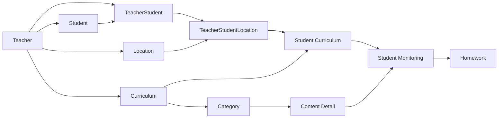

# LessonPT

LessonPT는 음악 레슨에서 교사가 학생별 수업 장소, 커리큘럼, 현재 진도, BPM, 과제를 한 흐름으로 관리하는 학습 관리 시스템이다. 교사는 재사용할 교육 구조를 만들고, 학생마다 실제로 어디까지 배웠는지를 따로 기록한다. 학생은 별도 회원가입 없이, 교사가 등록한 프로필과 이메일 인증으로 자신의 수업 기록만 읽는다.

## Why LessonPT

같은 곡이나 같은 루디먼트를 가르쳐도 학생마다 기록이 달라진다.

- 지금 어느 내용을 하고 있는지
- 그 내용의 현재 BPM
- 다음 수업 전에 할 과제
- 교사가 설계한 커리큘럼과, 그 학생이 실제로 밟고 있는 학습경로

이 정보가 메모, 메신저, 개인 파일에 흩어지면 다음 수업 준비와 진도 설명이 교사 기억에 의존한다. LessonPT는 그 운영 문제를 데이터 관계로 고정하기 위해 시작했다. 커리큘럼 원본과 학생별 학습 기록을 분리해, “이 과정을 배운다”와 “이 내용을 지금 이 상태로 연습 중이다”를 다른 사실로 다룬다.

## Core Principle

**Curriculum은 Teacher가 설계하는 재사용 가능한 교육 구조이고, 실제 학생의 학습경로는 Student Curriculum과 Student Monitoring에서 관리한다.**

Curriculum을 학생에게 배정해도 Content Detail 전부가 Monitoring으로 만들어지지 않는다. 배정은 그 장소의 수업에서 그 커리큘럼을 사용한다는 관계만 만든다. Monitoring은 교사가 특정 Content Detail을 골랐을 때 한 건씩 생긴다. 아직 다루지 않은 내용까지 진행 상태로 채워 두면, 진도와 과제가 실제 수업보다 앞서 보이게 된다.

## Users

### Teacher

Teacher는 직접 가입하는 계정이다. 로그인 후 자신의 출강처, 학생, 커리큘럼, 모니터링, 과제를 만들고 수정한다. 다른 교사의 데이터는 조회되지 않는다.

### Student

Student는 회원가입 계정이 아니다. 교사가 등록하는 학습자 프로필이며, 비밀번호와 역할이 없다. 이메일은 있을 수도 있고 없을 수도 있다.

접근은 두 가지다.

- 교사가 연 조회 링크. 링크는 특정 교사–학생 관계에 묶이며, 링크만으로 기록이 열리지는 않는다. 학생이 이메일을 입력하고 인증번호를 확인한 뒤 그 관계의 수업을 본다.
- 이메일 인증번호 로그인. 인증 후 연결되어 있는 교사 관계를 고르면 그 수업 기록을 본다. 한 학생이 여러 교사와 연결될 수 있다.

학생 화면은 읽기 전용이다. 진도, BPM, 과제, 메모를 학생이 바꾸지 않는다.

## Main User Flow



수업 준비는 다음 순서로 읽으면 된다.

1. 교사가 출강처와 커리큘럼을 만든다.
2. 커리큘럼 안에 Category와 Content Detail을 둔다.
3. 학생 프로필을 등록하고 자신의 학생으로 연결한다.
4. 그 관계를 출강처에 연결한 뒤, 그 장소 수업에 커리큘럼을 배정한다.
5. 이번에 다룰 Content Detail만 Monitoring으로 연다.
6. BPM, 진행 상태, 메모, 과제를 Monitoring에 기록한다.
7. 학생은 인증 후 배정된 활성 기록만 본다.

## Core Features

### Student Management

교사가 학생 이름과 이메일을 등록하고, 자신과의 관계를 만들거나 해제한다. 관계 해제는 학생 프로필을 지우지 않는다. 접근 링크도 이 화면에서 열거나 거둘 수 있다.

### Location

교사의 출강처를 등록하고 표시 순서를 유지한다. 학생은 교사–학생 관계를 통해 출강처에 연결된다.

### Curriculum Management

커리큘럼, Category, Content Detail을 만들고 수정하며 비활성화할 수 있다. Content Detail에는 목표 BPM과 영상 URL을 둘 수 있고, 악보·음원 파일은 수업 자료로 올린다.

### Student Curriculum

출강처에 연결된 수업에 커리큘럼을 배정한다. 같은 조합이 이미 있으면 중복으로 만들지 않고, 비활성 행이 있으면 그 행을 다시 연다.

### Student Monitoring

배정된 커리큘럼 안에서 Content Detail을 하나씩 연다. 현재 BPM, 진행 상태, 메모를 기록한다. 진행 상태는 Yet, InProgress, Completed, Stopped이며 상태 사이 이동을 제한하지 않는다.

### Progress

진도율은 저장 컬럼이 아니다. 조회할 때 Student Curriculum 단위로 계산한다. 분모는 그 커리큘럼의 활성 Content Detail 수이고, 분자는 그중 Completed인 활성 Monitoring 수다. Yet, InProgress, Stopped는 완료에 넣지 않는다. 활성 Content Detail이 없으면 진도율을 만들지 않는다. 백분율은 소수점 한 자리, 반올림이다.

### BPM

Content Detail의 목표 BPM과 Monitoring의 현재 BPM은 60 이상 240 이하다. 비어 있을 수 있다. BPM과 진행 상태는 서로 자동으로 바꾸지 않는다.

### Homework

과제는 Monitoring에 달린다. 활성 과제는 Monitoring마다 최대 3개다. 내용, 마감, 완료 여부, 피드백을 가진다. 과제 완료는 진도 상태와 별개다.

### Lesson Resources

Content Detail마다 활성 악보 하나, 활성 음원 하나를 파일로 둔다. 파일은 Oracle 밖 객체 저장소에 두고, DB에는 파일 메타데이터만 남긴다. 영상은 URL로 Content Detail에 남긴다. 학생은 자신에게 열린 자료만 받는다.

### Student Portal

이메일 인증 뒤 학생 이름, 연결된 교사 관계, 배정된 수업·진도·BPM·과제를 보여 준다. 수정 버튼은 학생 화면에 없다.

### Authentication

교사 로그인과 학생 이메일 인증이 구현되어 있다. 상세 정책은 아래 Authentication에 적는다.

## Important Service Policies

### Curriculum과 Student Monitoring

문제: 커리큘럼을 배정하는 순간 모든 내용을 학생 진도로 만들면, 아직 수업하지 않은 항목이 진행 중처럼 보인다.

결정: 배정은 Student Curriculum만 만들고, Monitoring은 Content Detail을 지정할 때 생성한다. 같은 내용의 비활성 Monitoring이 있으면 BPM, 진행 상태, 메모를 유지한 채 다시 연다.

이유: 교육 구조와 실제 학습 기록을 분리해야 진도와 과제가 수업 사실을 따라간다.

### Progress 계산

문제: 진행 상태를 바꿀 때마다 누적 컬럼을 고치면, 내용이 빠지거나 되살아날 때 숫자가 어긋난다.

결정: 조회 시점에 활성 Content Detail과 Completed Monitoring을 센다.

이유: 원본 내용의 활성 여부가 바뀌어도 진도율의 기준이 한곳에 남는다.

### Soft Delete

문제: 수업 이력을 물리 삭제하면 나중에 “그때 무엇을 하고 있었는지”를 확인할 수 없다.

결정: 삭제 대신 `STATUS = N`과 `DELETED_AT`을 남기고, 조건이 맞으면 복구한다. 커리큘럼을 지우면 그 아래 Category와 Content Detail의 활성 행도 함께 비활성화한다. Monitoring을 지우면 그 활성 과제도 같은 트랜잭션에서 비활성화한다.

이유: 화면의 현재 목록과 과거의 학습 기록을 구분하면서, 상위가 사라진 하위 활성 행을 남기지 않는다.

### Teacher와 Student

문제: 한 학생을 여러 교사가 가르칠 수 있고, 한 교사가 관계를 끊어도 학생 자체나 다른 교사의 기록이 사라져서는 안 된다.

결정: Student 프로필과 Teacher–Student 관계를 나눈다. 교사의 관계 해제는 그 관계, 접근 권한, 장소 연결, 커리큘럼 배정을 비활성화한다. 학생 프로필, Monitoring, Homework 행은 그대로 둔다. 관계를 다시 열어도 장소·배정·조회 세션은 자동으로 되살리지 않는다.

이유: “이 학생을 더 이상 내가 관리하지 않는다”와 “이 학생의 과거 수업 기록을 지운다”는 다른 조치다.

### Student access

문제: 학생에게 비밀번호 계정을 만들면 가입, 비밀번호 분실, 계정 공유가 수업 운영과 섞인다.

결정: 교사가 프로필을 만든다. 학생은 이메일 인증번호로 본인 확인 후 읽기 전용 세션을 받는다. 인증번호는 10분, 재발송 간격 60초, 실패 5회 후 10분 잠금이다. 세션은 비활동 30일, 절대 만료 180일이다. 만료까지 7일 이하로 남고 접속이 정상이면 비활동 만료를 늘린다. 마지막 접속 시각은 24시간이 지난 뒤에 갱신한다.

이유: 조회 권한을 교사–학생 관계에 붙이고, 학생이 수업 기록을 수정하지 않게 한다.

### DISPLAY_ORDER

문제: 출강처, 커리큘럼, 분류, 내용, 모니터링의 순서가 동시에 바뀌면 번호가 겹치거나 빈다.

결정: 순서는 부모 범위 안에서만 의미가 있다. 출강처와 커리큘럼은 교사, Category는 커리큘럼, Content Detail은 Category, Monitoring은 Student Curriculum이 범위다. 새 항목은 그 범위의 마지막 다음 번호를 받고, 삭제하면 뒤 번호를 당긴다. 변경 전 범위 행을 잠그고, 잠금을 3초 안에 얻지 못하면 409로 돌려보낸다.

이유: 전체 테이블을 잠그지 않고도 한 교사의 목록 순서를 유지한다. 끌어다 놓는 순서 변경 API와 화면은 없다.

### Homework 제한

문제: 한 내용에 과제가 제한 없이 쌓이면 이번 수업의 과제가 무엇인지 흐려진다.

결정: 활성 과제는 Monitoring당 3개까지다. 한도를 넘는 생성은 거절한다. 동시 생성은 Monitoring 행 잠금으로 막는다.

이유: 과제 목록이 다음 연습의 범위로 남게 한다.

### 관계 검증

문제: 장소, 커리큘럼, 내용이 서로 다른 교사 소유여도 외래 키만으로는 막히지 않는 조합이 있다.

결정: 서비스가 다음을 확인한다.

- 연결하려는 출강처의 소유 교사와 교사–학생 관계의 교사가 같다.
- 배정하려는 커리큘럼의 소유 교사와 그 관계의 교사가 같다.
- Monitoring에 넣는 Content Detail이 그 Student Curriculum의 커리큘럼에 속한다.

이유: 데이터베이스 제약으로 표현하기 어려운 소유 일치를 저장 전에 거절한다.

## Data Model

핵심은 두 줄이다.

```text
Teacher → Curriculum → Category → Content Detail → Content Resource
Teacher → Student → TeacherStudent → TeacherStudentLocation
        → Student Curriculum → Student Monitoring → Homework
```

Teacher와 Student는 계정을 공유하지 않는다. 둘의 연결은 TeacherStudent다. 수업이 열리는 장소는 TeacherStudentLocation이고, 그 장소 수업에 올린 커리큘럼이 Student Curriculum이다. Monitoring은 그 배정 안에서 실제로 연 Content Detail이다.

인증은 학습 테이블과 따로 있다. 교사 토큰 상태는 Teacher Auth Session에, 학생 조회 링크는 Teacher Student Access에, 인증번호와 조회 세션은 각각 검증 테이블과 Student Access Session에 있다.

수업 자료 파일은 Content Resource와 저장 한도용 잠금 행으로 이후 추가되었다. 학생의 일반 로그인 인증번호도 링크 인증번호와 다른 테이블에 있다.

전체 컬럼과 제약은 아래 Schema 문서를 본다. 그 문서는 최초 15개 테이블 기준선이고, 자료 파일·학생 로그인 변경은 `backend/src/main/resources/db/`의 이후 스크립트에 있다.

## CX / Troubleshooting Perspective

운영 문의는 증상만으로 원인을 정하지 않는다. 아래 순서로 확인된 사실과 아직 모르는 사실을 나눈다.

1. 증상: 누가, 어느 학생, 어느 화면에서, 무엇을 기대했는지
2. 재현: 같은 계정과 같은 학생으로 다시 보이는지
3. 화면: 교사 화면과 학생 화면 중 어디인지, 새로고침 뒤에도 같은지
4. API: 상태 코드, 오류 코드, 응답의 `traceId`
5. 로그: 그 `traceId`가 서버 로그에 있는지
6. SQL: 해당 Student Curriculum, Monitoring, Content Detail의 `STATUS`, `DELETED_AT`, `PROGRESS_STATUS`
7. 관계: 교사–학생 관계, 장소 연결, 커리큘럼 소유가 같은 교사인지
8. 분류: 화면 표시, API, 계산 기준, 데이터 관계, 권한 중 어디까지 확인됐는지
9. 조치: 확인된 범위만 고치거나 안내한다
10. 재확인: 같은 조건의 교사 화면과 학생 화면을 다시 본다

오류 응답에는 `traceId`가 포함되고, 서버 로그에도 같은 값이 남는다. 건강 확인은 `/actuator/health`이며 Oracle 연결이 되면 스키마 이름을 함께 본다. 운영 프로파일에서는 건강 응답의 상세를 숨긴다.

### Example Diagnostic Scenario

아래는 저장된 장애 보고서가 아니다. 진도 계산이 어떻게 어긋나 보일 수 있는지 보여 주는 확인 절차다.

증상으로 “교사 화면에서는 Completed인데 학생 진도가 오르지 않는다”가 들어왔다고 가정한다.

- 그 Monitoring의 `PROGRESS_STATUS`가 `Completed`인지, `STATUS`가 활성이고 `DELETED_AT`이 비었는지 본다.
- 연결된 Content Detail이 아직 활성인지 본다. 내용이 비활성이면 완료 건수에 넣지 않는다.
- 분모가 되는 활성 Content Detail이 더 있는지도 본다. 하나를 완료해도 전체가 완료되기 전에는 진도율이 100이 되지 않는다.
- 학생 화면의 수업이 같은 Student Curriculum인지 본다. 다른 교사 관계이거나 범위 선택이 다르면 다른 배정을 보고 있을 수 있다.
- 여기까지 확인하기 전에는 화면 결함인지 계산 기준인지 정하지 않는다.

## Tech Stack

버전은 저장소의 빌드 설정과 워크플로에 적힌 값이다.

### Backend

- Java 21
- Spring Boot 4.1.1
- Spring MVC, Validation, Security, Actuator, Mail
- MyBatis Spring Boot Starter 4.1.0
- Maven Wrapper
- JWT 라이브러리 nimbus-jose-jwt 10.3
- Oracle JDBC `ojdbc17`
- OCI Java SDK 3.66.0, Object Storage 클라이언트

### Frontend

- React 19.2.8
- React Router 7.18.4
- Vite 8.3.0
- TypeScript 6.0.2
- Vitest 5
- 개발 서버는 `/api`를 `localhost:8080`으로 프록시한다

### Database

- Oracle
- 애플리케이션이 기대하는 스키마 이름의 기본값은 `DRUMMER_LMS`
- 접속 URL, 계정, 비밀번호는 환경 변수로 받는다

### Infrastructure

- GitHub Actions가 빌드한 산출물을 OCI 호스트에 올린다
- 호스트의 systemd 서비스 `lessonpt`가 JAR를 실행한다
- Nginx가 `/var/www/lessonpt`의 프론트 정적 파일을 제공한다
- 수업 자료 파일 저장소는 OCI Object Storage를 전제로 설정되어 있다

### CI/CD

- CI: `dev`, `main`에 대한 push와 pull request. Java 21, Node.js 22
- Production CD: `main` push. 상세는 아래 배포 절을 본다

## Backend Architecture

요청은 아래 방향으로 흐른다.

```text
Controller → Service → Mapper → Oracle
```

- Controller는 HTTP와 인증 주체를 받고 응답으로 바꾼다.
- Service는 트랜잭션과 도메인 규칙을 담당한다. 순서 변경, 삭제 연쇄, 진도 계산, 과제 개수, 소유 검증이 여기 있다.
- Mapper와 MyBatis XML은 SQL을 실행한다.
- DTO는 API 입출력이다.
- Domain은 테이블 행에 대응하는 객체다.

공통 예외 처리가 검증 오류와 업무 오류를 같은 응답 형식으로 바꾼다. 패키지 루트는 `com.yunki.lessonpt`다.

## Authentication

### Teacher

가입과 로그인을 사용한다. 비밀번호는 BCrypt다. Access Token은 60분, Refresh Token은 14일이다. 원문 토큰은 저장하지 않고 Access Token의 `jti`와 Refresh Token 해시만 Oracle 세션 행에 둔다. 매 요청에서 서명·만료와 활성 세션 행을 함께 본다. 로그아웃은 그 세션 행을 지운다. 프론트는 두 토큰을 `sessionStorage`에 둔다.

### Student

인증번호 확인 후 세션 토큰 해시를 Oracle에 저장하고, 브라우저에는 `HttpOnly` 쿠키 `LESSONPT_STUDENT_SESSION`을 준다. 배포 설정의 쿠키는 `Secure`다. 로컬 HTTP에서는 `Secure`를 끄고 `SameSite=Lax`를 쓴다. 인증번호도 Oracle에 둔다.

학생 API는 `/api/v1/student/**` 읽기와 세션 범위 선택·로그아웃이다. 교사 API는 교사 주체가 필요하다.

## Database Verification

Schema v3 기준선은 `VERIFY_DRUMMER_LMS_SCHEMA_V3.sql`로 검증이 끝나 있다. 그 스크립트의 기대값은 학습·인증 15개 테이블 기준이다.

- Tables 15, Sequences 15, Triggers 15
- PK 15, FK 17, UNIQUE 11, named CHECK 43, lookup index 15
- 비활성 제약과 트리거 없음

이 수치는 최초 Schema v3 기준선이다. 이후 migration 스크립트는 `backend/src/main/resources/db/`에 있으며, 수업 자료 테이블, 학생 로그인 검증 테이블, 학생 세션 컬럼 변경을 다룬다. 각 스크립트에 확인 SQL이 있어도, 그 결과는 현재 전체 스키마를 한 번에 검증한 기록이 아니다.

현재 데이터베이스 전체에 대한 통합 검증은 아직 하지 않았다. 위에 적은 값은 Schema v3 기준선에만 해당한다. 이후 migration까지 포함한 통합 검증은 별도 작업이다.

## CI/CD & Deployment

브랜치 역할은 다음과 같다.

```text
feature/* → dev → main
```

`dev`는 통합 개발 브랜치이고 CI만 실행한다. `main`이 Production 기준이며, OCI 자동 배포는 `main` push에서만 실행된다. `feature/*`에는 배포 워크플로가 없다.

| 워크플로 | 실행 조건 | 하는 일 |
|---|---|---|
| `ci.yml` | `dev`, `main` push와 pull request | 백엔드 `mvnw verify`, 프론트 lint·test·build. 산출물은 보관만 한다 |
| `deploy.yml` | `main` push | 검증과 빌드 후 JAR와 프론트 빌드를 OCI로 보낸다 |
| `deploy-smoke.yml` | 이 파일 자신을 수정한, `dev`로 향하는 pull request | SSH로 호스트의 Java, Nginx, 배포 경로, systemd 설정을 본다. 배포하지 않는다 |

CI와 CD 모두 빌드 JDK는 Java 21이다. OCI 호스트의 Java 버전은 저장소에 고정되어 있지 않다. 스모크 워크플로는 호스트에서 `java -version`을 출력할 뿐, 특정 버전을 검사하지 않는다.

배포는 서버에서 소스를 빌드하지 않는다. GitHub Actions가 `lessonpt.jar`와 프론트 정적 파일을 만든 뒤 SSH로 복사한다. 호스트는 기존 JAR를 릴리스 디렉터리에 남기고, 프론트 디렉터리를 교체한 다음 `lessonpt` 서비스를 재시작한다. 90초 안에 `http://127.0.0.1:8080/actuator/health`가 `UP`이 아니면 이전 JAR와 프론트로 되돌린다. 성공 후에는 Nginx가 동작 중인지와 `http://127.0.0.1/` 응답을 확인한다. 직전 JAR는 최근 3개만 남긴다.

GitHub Actions 시크릿은 `OCI_SSH_PRIVATE_KEY`, `OCI_HOST`, `OCI_USER`다. 호스트 서비스는 `LESSONPT_PROFILE=prod`와 `/etc/lessonpt/lessonpt.env`를 읽도록 스모크 검사가 확인한다. 애플리케이션이 배포 환경에서 요구하는 값은 데이터베이스 URL·계정·비밀번호, JWT 비밀, 메일 서버 정보, OCI 설정 파일 경로다.

`dev` push는 CI만 돈다. Production 배포는 `main` push의 `deploy.yml`이 담당한다. `feature/*` push에는 CI와 배포가 연결되어 있지 않다.

## Current Status

### Implemented

- 교사 가입, 로그인, 토큰 재발급, 로그아웃
- 출강처, 학생, 커리큘럼, Category, Content Detail
- 학생–장소 연결, 커리큘럼 배정, Monitoring, 진도 계산, BPM, Homework
- Soft Delete와 복구, 표시 순서의 생성·삭제 정리
- 학생 조회 링크 인증, 이메일 로그인 인증, 읽기 전용 포털, 여러 교사 중 관계 선택
- 악보·음원 업로드와 학생의 자료 조회, 영상 URL
- 교사 화면과 학생 화면의 API 연동. 화면용 목업 데이터는 없다
- Oracle Schema v3 기준선 검증, 이후 마이그레이션 스크립트, 백엔드·프론트 테스트
- `main` push 기준 GitHub Actions 빌드와 OCI 배포 워크플로

위 항목은 코드와 워크플로로 확인한 구현 범위다.

### In Progress

아래는 기능 구현 여부와 구분한 현재 프로젝트 관리 상태다.

- Teacher 중심 UI/UX 리디자인
- 포트폴리오에 공개할 화면 선별과 QA

Student Portal은 기능이 구현되어 있다. 포트폴리오 공개 범위는 Teacher 운영 화면을 중심으로 잡는 중이다.

### Planned / Remaining

코드와 설계 문서를 기준으로 아직 없는 항목이다.

- 순서 끌어다 놓기
- 독립된 대시보드 화면. `/dashboard`는 학생 목록으로 보낸다
- 고정 데모 교사, 데모 계정의 쓰기 차단, 데모 데이터 초기화
- 이메일 없는 학생용 PDF 보고서
- 인증 메일 안내와 장애 사례를 정리한 운영 문서
- Schema v3 이후 migration까지 포함한 현재 전체 Schema 통합 검증

## Portfolio Demo Scope

코드에는 교사 화면과 학생 포털이 모두 있다. 포트폴리오에서 공개할 범위는 Teacher 운영 화면이다. 화면 선별과 QA는 진행 중이다.

- 교사 로그인 후 학생 목록과 학생 상세
- 출강처 연결, 커리큘럼 배정
- Content Detail 선택, Monitoring의 진행 상태와 BPM
- Homework
- 커리큘럼 빌더와 악보·음원·영상

Student Portal은 이메일 인증과 읽기 전용 조회까지 구현되어 있다. 이번 포트폴리오 공개의 중심 화면에는 넣지 않는다. 데모 전용 로그인과 비밀번호를 URL에 넣는 경로는 없다.

## Documentation

아래 파일은 2026-09-23 설계 기준선이다. 당시 문서는 Spring Boot 구현 직전 상태를 적고 있으며, Java 25와 패키지 `com.yunki.drummerlms`를 전제로 한다. 현재 코드는 Java 21, 패키지 `com.yunki.lessonpt`이며 이 README가 구현 상태를 설명한다.

- [프로젝트 가이드](backend/.cursor-context/01-project/PROJECT_GUIDE_v3_2026-09-23.md)
- [백엔드 결정 기록](backend/.cursor-context/02-backend/BACKEND_DECISION_RECORD_V2_1_2026-09-23.md)
- [백엔드 아키텍처](backend/.cursor-context/02-backend/BACKEND_ARCHITECTURE_V2_2026-09-23.md)
- [구현 백로그](backend/.cursor-context/02-backend/BACKEND_IMPLEMENTATION_BACKLOG_V2_1_2026-09-23.md)
- [Oracle Schema v3 DDL](backend/.cursor-context/03-database/drummer_lms_oracle_schema_v3.sql)
- [Schema v3 검증 SQL](backend/.cursor-context/03-database/VERIFY_DRUMMER_LMS_SCHEMA_V3.sql)
- 이후 DB 변경: `backend/src/main/resources/db/`

`frontend/README.md`는 Vite 템플릿 안내이며 LessonPT 제품 설명이 아니다.

## Local Development

백엔드는 `backend`에서 Maven Wrapper로 실행한다. 기본 프로파일은 `local`이다. 데이터베이스 비밀번호와 JWT 비밀은 환경 변수로 두고, 로컬 전용 설정 파일은 저장소에 넣지 않는다.

프론트는 `frontend`에서 개발 서버를 띄운다. API 호출은 같은 출처의 `/api`를 쓰고, 개발 중에는 Vite가 백엔드로 넘긴다. 배포 빌드는 `VITE_API_BASE_URL`로 API 기준 경로를 바꿀 수 있다.
